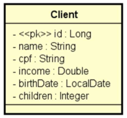

# 💻 API REST, camadas, CRUD, exceções, validações

## 📝 Desafio: CRUD de clientes
Você deverá entregar um projeto Spring Boot contendo um CRUD completo de web services REST para acessar um recurso de clientes, contendo as cinco operações básicas aprendidas no capítulo:
- Busca paginada de recursos
- Busca de recurso por id
- Inserir novo recurso
- Atualizar recurso
- Deletar recurso

O projeto deverá estar com um ambiente de testes configurado acessando o banco de dados H2, deverá usar
Maven como gerenciador de dependência, e Java como linguagem. 

Um cliente possui nome, CPF, renda, data de nascimento, e quantidade de filhos. A especificação da entidade Client é mostrada a seguir (você deve seguir à risca os nomes de classe e atributos mostrados no diagrama):



**Seu projeto deverá fazer um seed de pelo menos 10 clientes** com dados SIGNIFICATIVOS (não é para usar dados sem significado como “Nome 1”, “Nome 2”, etc.).

**Seu projeto deverá tratar as seguintes exceções:**
- Id não encontrado (para GET por id, PUT e DELETE), retornando código 404.
- Erro de validação, retornando código 422 e mensagens customizada para cada campo inválido. As regras de validação são:
	- Nome: não pode ser vazio
	- Data de nascimento: não pode ser data futura (dica: use @PastOrPresent)

## Requisições

Busca de cliente por id
```
GET /clients/1
```

Busca paginada de clientes
```
GET /clients?page=0&size=6&sort=name
```

Inserção de novo cliente
```
POST /clients
{
"name": "Maria Silva",
"cpf": "12345678901",
"income": 6500.0,
"birthDate": "1994-07-20",
"children": 2
}
```

Atualização de cliente
```
PUT /clients/1
{
"name": "Maria Silvaaa",
"cpf": "12345678901",
"income": 6500.0,
"birthDate": "1994-07-20",
"children": 2
}
```

Deleção de cliente
```
DELETE /clients/1
```

## Checklist
1. Busca por id retorna cliente existente
2. Busca por id retorna 404 para cliente inexistente
3. Busca paginada retorna listagem paginada corretamente
4. Inserção de cliente insere cliente com dados válidos
5. Inserção de cliente retorna 422 e mensagens customizadas com dados inválidos
6. Atualização de cliente atualiza cliente com dados válidos
7. Atualização de cliente retorna 404 para cliente inexistente
8. Atualização de cliente retorna 422 e mensagens customizadas com dados inválidos
9. Deleção de cliente deleta cliente existente
10. Deleção de cliente retorna 404 para cliente inexistente


