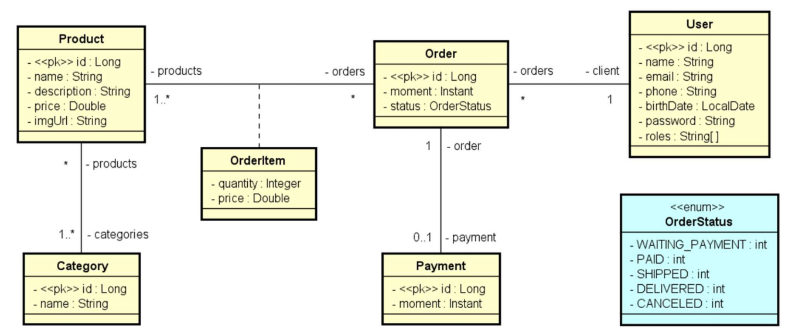
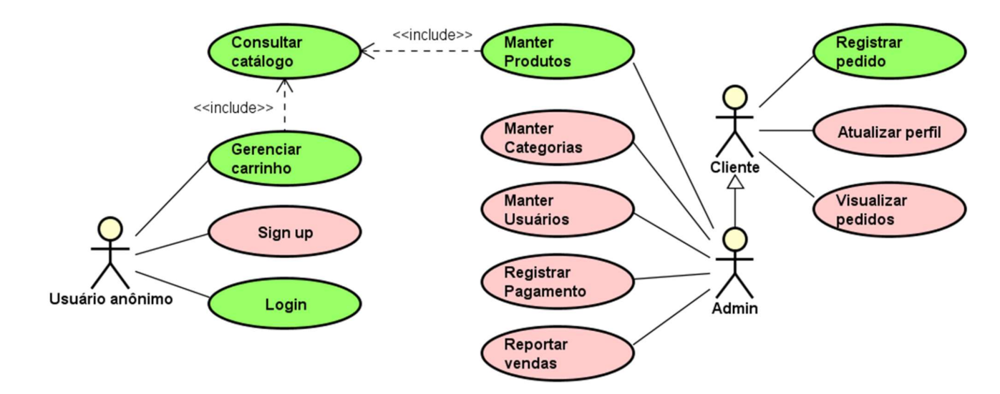

# 💻 Login e controle de acesso

## 📝 Desafio: Projeto Spring Boot estruturado

Você deverá entregar o projeto DSCommerce estruturado e com todas funcionalidades implementadas conforme as aulas.

O projeto deve ser implementado com Java e Spring Boot, usando banco de dados H2, conforme aulas.

Para atestar que você implementou gradualmente o projeto, será exigido que seu projeto no Github tenha pelo menos 12 commits no seu usuário do Github.

### Visão Geral do Sistema

O sistema deve manter um cadastro de usuário, produtos e suas categorias. Cada usuário possui nome, email, telefone, data de nascimento e uma senha de acesso. Os dados dos produtos são: nome, descrição, preço e imagem. O sistema deve apresentar um catálogo de produtos, os quais podem ser filtrados pelo nome do produto. A partir desse catálogo, o usuário pode selecionar um produto para ver seus detalhes e para decidir se o adiciona a um carrinho de compras. O usuário pode incluir e remover itens do carrinho de compra, bem como alterar as quantidades de cada item. Uma vez que o usuário decida encerrar o pedido, o pedido deve então ser salvo no sistema com o status de "aguardando pagamento". Os dados de um pedido são: instante em que ele foi salvo, status, e uma lista de itens, onde cada item se refere a um produto e sua quantidade no pedido. O status de um pedido pode ser: aguardando pagamento, pago, enviado, entregue e cancelado. Quando o usuário paga por um pedido, o instante do pagamento deve ser registrado. Os usuários do sistema podem ser clientes ou administradores, sendo que todo usuário cadastrado por padrão é cliente. Usuários não identificados podem se cadastrar no sistema, navegar no catálogo de produtos e no carrinho de compras. Clientes podem atualizar seu cadastro no sistema, registrar pedidos e visualizar seus próprios pedidos. Usuários administradores tem acesso à área administrativa onde pode acessar os cadastros de usuários, produtos e categorias.

### Modelo Conceitual

Este é o modelo conceitual do sistema DSCommerce. Considerações:

- Cada item de pedido (OrderItem) corresponde a um produto no pedido, com uma quantidade. Sendo que o preço também é armazenado no item de pedido por questões de histórico (se o preço do produto mudar no futuro, o preço do item de pedido continua registrado com o preço real que foi vendido na época).

- Um usuário pode ter um ou mais "roles", que são os perfis de acesso deste usuário no sistema (client, admin).

### Casos de Uso (Visão Geral)

O escopo funcional do sistema consiste nos seguintes casos de uso:

| Caso de uso           | Visão geral                                                                                                     | Acesso          |
|-----------------------|-----------------------------------------------------------------------------------------------------------------|-----------------|
| Manter produtos       | CRUD de produtos, podendo filtrar itens pelo nome                                                               | Somente Admin   |
| Manter categorias     | CRUD de categorias, podendo filtrar itens pelo nome                                                             | Somente Admin   |
| Manter usuários       | CRUD de usuários, podendo filtrar itens pelo nome                                                               | Somente Admin   |
| Gerenciar carrinho    | Incluir e remover itens do carrinho de compras, bem como alterar as quantidades do produto em cada item         | Público         |
| Consultar catálogo    | Listar produtos disponíveis, podendo filtrar produtos pelo nome                                                 | Público         |
| Sign up               | Cadastrar-se no sistema                                                                                         | Público         |
| Login                 | Efetuar login no sistema                                                                                        | Público         |
| Registrar pedido      | Salvar no sistema um pedido a partir dos dados do carrinho de compras informado                                 | Usuário logado  |
| Atualizar perfil      | Atualizar o próprio cadastro                                                                                    | Usuário logado  |
| Visualizar pedidos    | Visualizar os pedidos que o próprio usuário já fez                                                              | Usuário logado  |
| Registrar pagamento   | Salvar no sistema os dados do pagamento de um pedido                                                            | Somente Admin   |
| Reportar pedidos      | Relatório de pedidos, podendo ser filtrados por data                                                            | Somente Admin   |

#### Atores

| Ator              | Responsabilidade                                                                                                                                                      |
|-------------------|-----------------------------------------------------------------------------------------------------------------------------------------------------------------------|
| Usuário anônimo   | Pode realizar casos de uso das áreas públicas do sistema, como catálogo, carrinho de compras, login e sign up.                                                        |
| Cliente           | Responsável por manter seu próprios dados pessoais no sistema, e pode visualizar histórico dos seus pedidos. Todo usuário cadastrado por padrão é um Cliente.         |
| Admin             | Responsável por acessar a área administrativa do sistema com cadastros e relatórios. Admin também pode fazer tudo que Cliente faz.                                    |

### Casos de Uso (Detalhamento)

#### Consultar Catálogo
| Atores        | Usuário anônimo, Cliente, Admin |
|---------------|---------------------------------|
| Precondições  | -                               |
| Pós-condições | -                               |
| Visão geral   | Listar produtos disponíveis, podendo filtrar produtos pelo nome |

| Cenário principal de sucesso |
|------------------------------|
| 1. [OUT] O sistema informa uma listagem paginada de nome, imagem e preço dos produtos, ordenada por nome. |
| 2. [IN] O usuário informa, opcionalmente, parte do nome de um produto |
| 3. [OUT] O sistema informa a listagem atualizada |

| Informações complementares |
|----------------------------|
| O número padrão de registros por página deve ser 12. Como a listagem é paginada, o usuário pode navegar nas próximas páginas. |

#### Manter Produtos
| Atores        | Admin |
|---------------|-------|
| Precondições  | Usuário logado |
| Pós-condições | -     |
| Visão geral   | CRUD de produtos, podendo filtrar itens pelo nome |

| Cenário principal de sucesso |
|------------------------------|
| 1. Executar caso de uso: Consultar catálogo. |
| 2. O admin seleciona uma das opções |
| 2.1. Variante Inserir |
| 2.2. Variante Atualizar |
| 2.3. Variante Deletar |

| Cenário alternativos: variantes |
|---------------------------------|
| 2.1. Variante Inserir |
| 2.1.1. [IN] O admin informa nome, preço, descrição e URL da imagem e categorias do produto. |
| 2.2. Variante Atualizar |
| 2.2.1. [IN] O admin seleciona um produto para editar. |
| 2.2.2. [OUT] O sistema informa nome, preço, descrição, URL da imagem e categorias do produto selecionado. |
| 2.2.3. [IN] O admin informa novos valores para nome, preço, descrição, URL da imagem e categorias do produto selecionado. |
| 2.3. Variante Deletar |
| 2.3.1. [IN] O admin seleciona um produto para deletar. |

| Cenário alternativos: exceções |
|--------------------------------|
| 2.1.1a. Dados inválidos |
| 2.1.1a.1. [OUT] O sistema informa os erros nos campos inválidos [1]. |
| 2.1.1a.2. Vai para passo 2.1.1. |
| 2.2.3a. Dados inválidos |
| 2.2.3a.1. [OUT] O sistema informa os erros nos campos inválidos [1]. |
| 2.2.3a.2. Vai para passo 2.2.1. |
| 2.2.3b. Id não encontrado |
| 2.2.3b.1. [OUT] O sistema informa que o id não existe. |
| 2.2.3b.2. Vai para passo 2.2.1. |
| 2.3.1a. Id não encontrado |
| 2.3.1a.1. [OUT] O sistema informa que o id não existe. |
| 2.3.1a.2. Vai para passo 2.3.1. |
| 2.3.1b. Integridade referencial violada |
| 2.3.1b.1. [OUT] O sistema informa que a deleção não pode ser feita porque viola a integridade referencial dos dados. |
| 2.3.1b.2. Vai para passo 2.3.1. |

| Informações complementares |
|----------------------------|
| [1] Validação dos dados:|
|- Nome: deve ter entre 3 e 80 caracteres |
|- Preço: deve ser positivo |
|- Descrição: não pode ter menos que 10 caracteres |
|- Deve haver pelo menos 1 categoria |

#### Login

| Atores        | Usuário anônimo |
|---------------|-----------------|
| Precondições  | -               |
| Pós-condições | Usuário logado  |
| Visão geral   | Efetuar login no sistema |

| Cenário principal de sucesso |
|------------------------------|
| 1. [IN] O usuário anônimo informa suas credenciais (nome e senha). |
| 2. [OUT] O sistema informa um token válido. |

| Cenário alternativos: exceções |
|--------------------------------|
| 1a. Credenciais inválidas |
| 1a.1. [OUT] O sistema informa que as credenciais são inválidas. |
| 1a.2. Vai para passo 1. |

#### Gerenciar carrinho

| Atores          | Usuário anônimo                                                                 |
|-----------------|--------------------------------------------------------------------------------|
| Precondições    | –                                                                              |
| Pós-condições   | –                                                                              |
| Visão geral     | Incluir e remover itens do carrinho de compras, bem como alterar as quantidades do produto em cada item |

